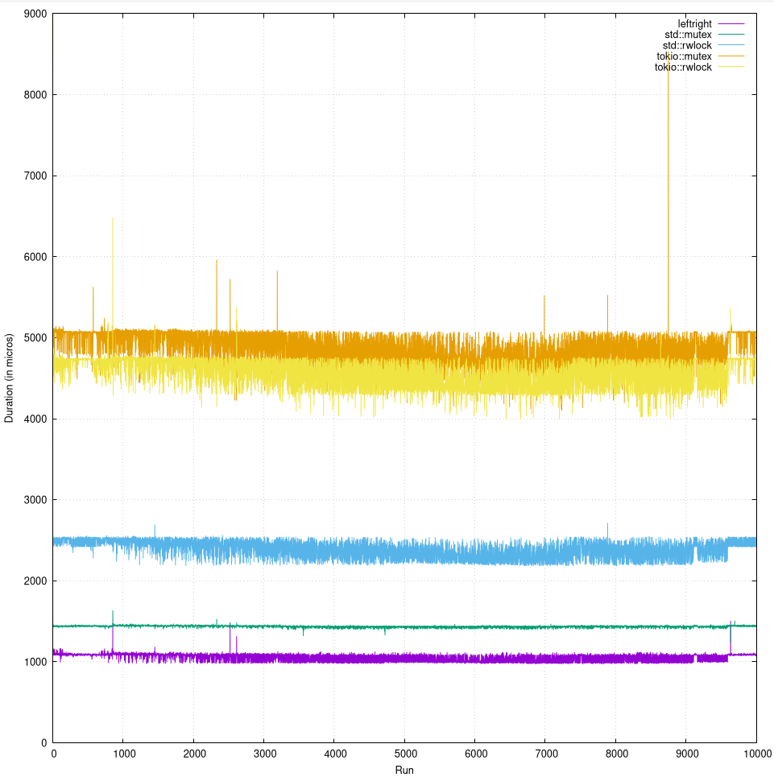
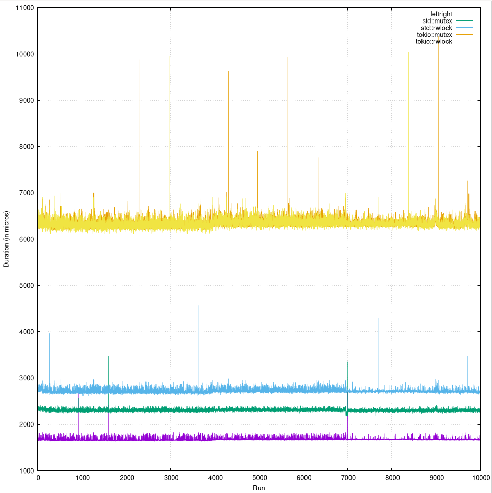

# Left Right written in rust

Inspired by [Left-Rigth: A Concurrency Control Technique with Wait-Free Population Oblivius Reads from Pedro Ramalhete and Andreia Correia](https://github.com/pramalhe/ConcurrencyFreaks/blob/master/papers/left-right-2014.pdf).

The blog from Pedro Ramlhete [Left-Right: Classical algorithm](https://concurrencyfreaks.blogspot.com/2013/12/left-right-classical-algorithm.html) was also used.

Besides that the unsafe code from [yacoder](https://github.com/yacoder/left-right-rwlock-rust) helped me how to actually use it.

## What is this

I used this repo benchmark and improve the code against `std::sync::Mutex`, `std::sync::RwLock`, `tokio::sync::Mutex` and finally `tokio::sync::RwLock`.

### DISCLAIMER

Currently the benchmark is only single core!

At least on my server (Threadripper 1950x) this implementation is faster than all of the above in read and write.

### Read

### Write

## Run it

In `src/main.rs` only line 21 or 22 should be uncommented, this will run all benchmarks and print the results to the terminal.

To create a graph based on the data use `cargo run --release | tee out` and when its done run `gnuplot plot.plt`.

You can change the variables `ITER` (line 16) and `RUN_PER_ITER` (line 17) to a larger or smaller value.
